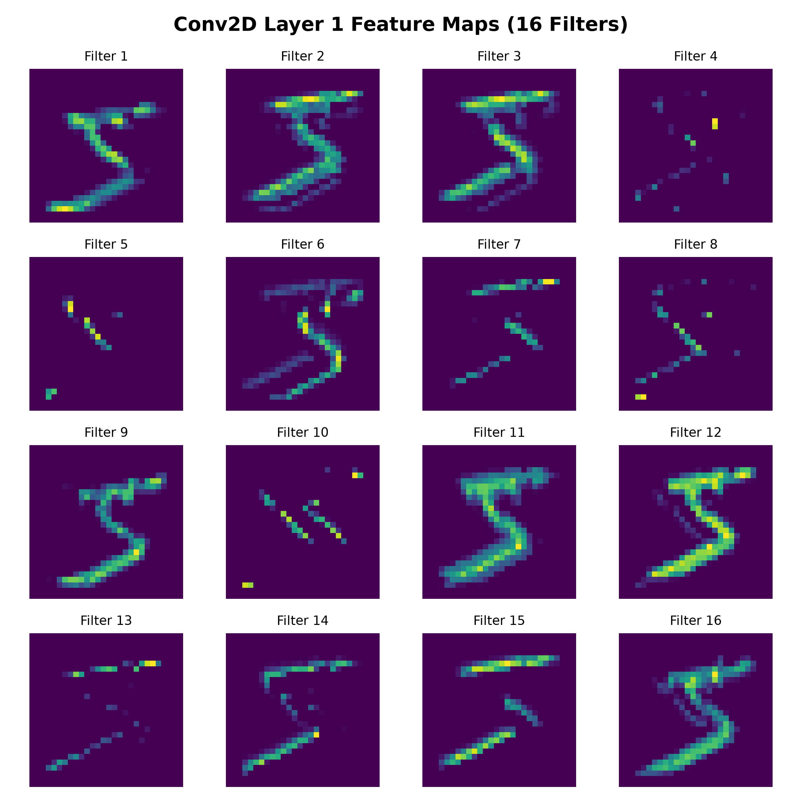
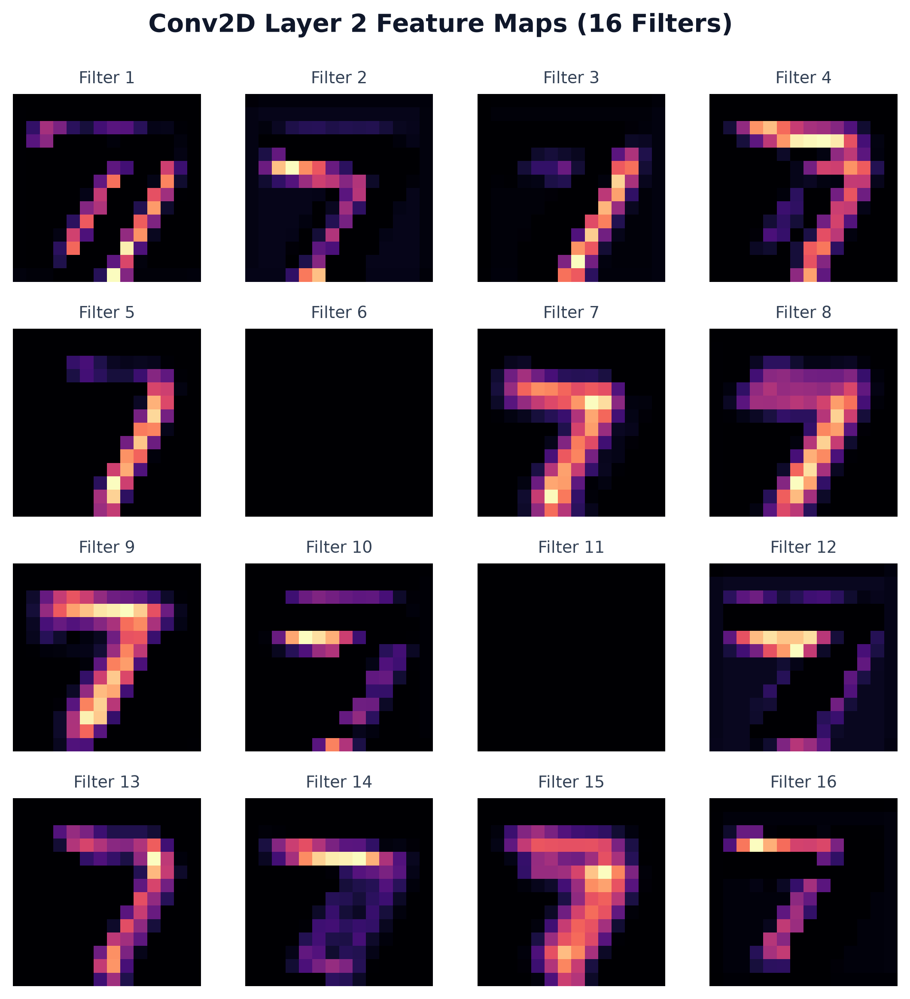
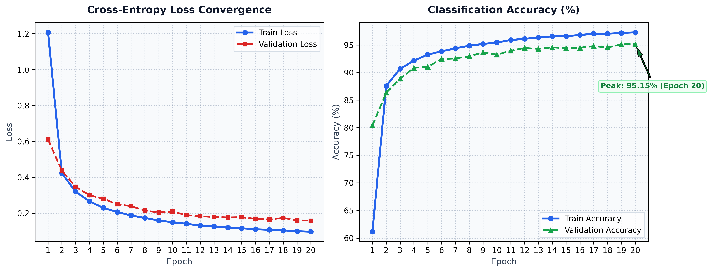

# Convolutional Neural Network from Scratch in NumPy

[](https://www.python.org/)
[](https://numpy.org/)
[](https://docs.pytest.org/)
[](https://github.com/Dan-Tan/Convolutional-Neural-Network/tree/v0.1.0-legacy)
[](LICENSE)

A 2D Convolutional Neural Network (CNN) framework implemented from first principles in NumPy, without relying on PyTorch or TensorFlow for model operations or automatic differentiation.

This project was originally created upon finishing high school as an early programming project to learn Python and understand neural network mathematics. The original unedited state is tagged as [`v0.1.0-legacy`](https://github.com/Dan-Tan/Convolutional-Neural-Network/tree/v0.1.0-legacy) (commit [`5cdbe1f`](https://github.com/Dan-Tan/Convolutional-Neural-Network/commit/5cdbe1fa7923f47897f59852014a45b88c0fcef8)) and preserved in [legacy/original_cnn.py](legacy/original_cnn.py). The repository contains both that original implementation and a modernized refactor with modular layer abstractions, type annotations, unit tests, and vectorized `im2col` acceleration.

---

## Visualizations

### Intermediate Feature Maps
Visualizing layer outputs shows how convolution filters detect edge primitives and feature boundaries:

| Layer 1 Feature Maps (16 Filters) | Layer 2 Feature Maps (32 Filters) |
| :---: | :---: |
|  |  |

### Training Convergence


---

## Quickstart & Usage

### 1. Installation
Clone the repository and install dependencies:

```bash
git clone https://github.com/Dan-Tan/Convolutional-Neural-Network.git
cd Convolutional-Neural-Network

python3 -m venv .venv
source .venv/bin/activate
pip install -r requirements.txt
```

### 2. Train the CNN
Run the training pipeline on MNIST:

```bash
python train.py --epochs 5 --batch-size 64 --lr 0.01
```

### 3. Generate Visualizations
Extract feature maps and generate plots in `assets/`:

```bash
python visualize.py
```

### 4. Run Tests
Run the test suite using `pytest`:

```bash
PYTHONPATH=. pytest
```

---

## License
This project is open-source under the [MIT License](LICENSE).
